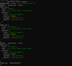
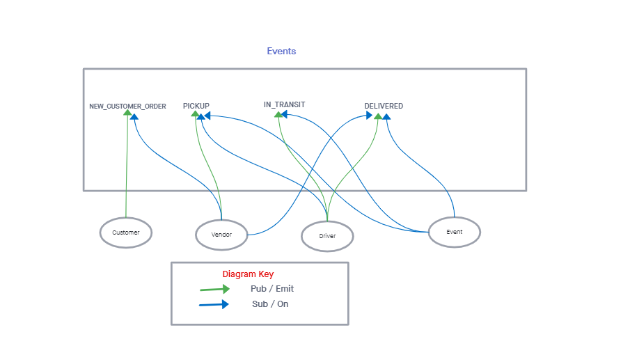

# Lab-11

## CAPS

### Author: Alan Chelko

### Problem Domain

    * CAPS Phase 1: Begin the build of an application for a product called CAPS - The Code Academy Parcel Service. In this sprint, we're building out a system that emulates a real world supply chain.
    * CAPS will simulate a delivery service where vendors (such a flower shops) will ship products using our delivery service and when our drivers deliver them, each vendor will be notified that their customers received what they purchased.
    * This will be an event driven application that “distributes” the responsibility for logging to separate modules, using only events to trigger logging based on activity.

### Setup

    * PORT: 3001

### Deployed server

    * Heroku: [chelko-basic-api-server-prod](https://dashboard.heroku.com/apps/chelko-caps-prod/)

### Running the app

    * node srd/node.js (runs the following event order process)

### UML: Basic Auth Server -- Lab 06 UML

