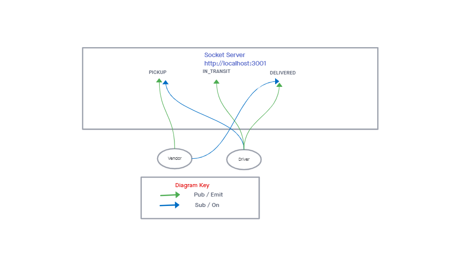

# Lab-12

## CAPS

### Author: Alan Chelko

### Collaborator: Ryan Gallaway (refactoring during code review)

### Problem Domain

    * CAPS Phase 2: Continue working on a multi-day build of our delivery tracking system, creating an event observable over a network with Socket.io.
    * In this phase, we’ll be moving away from using Node Events for managing a pool of events, instead refactoring to using the Socket.io libraries. This allows communication between Server and Client applications.
    * The intent here is to build the data services that would drive a suite of applications where we can see pickups and deliveries in real-time.

### Setup

    * PORT: 3001

### Running the app

    * node src/hub.js (to run the socket server)
    * node src/vendor/index.js (to run the vendor client-side)
    * node src/driver/index.js (to run the drive client-side)

### UML: Socket-io -- Lab 12

